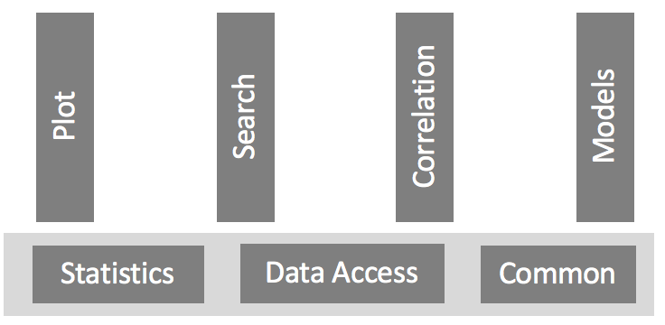

# ``microbepy`` (Pronounced "microbe pie")

Microbes such as bacteria and archaea are fundamental to life on earth, especially to human health. Characteristics of microbes (referred to as phenotypes) such as growth rate can evolve rapidly, often as a result of interactions with other microbes in a community. 

Understanding these evolutionary dynamics requires answering two questions: (a) What mutations are acquired over time by each species in the community? (b) How do mutations affect phenotypes? 
``microbepy`` is an open source python project for data driven discovery to answer these questions.
``microbepy`` facilitates the study of microbial communities including: the data used, the analyses done, and the visualizations employed.

Some biology background is required to understand the science questions and the data used in the development of ``microbepy``.
Considered is a microbe community of two organisms: a bacteria, Desulfovibrio vulgaris Hildenborough (hereafter, DVH); 
and an archaea, Methanococcus maripaludis (hereafter, MMP). 
There is no known natural habitat in which these organisms co-exist. 
However, by growing both with lactate, each assists the metabolic cycle of the other. When DVH metabolizes lactate, hydrogen is produced. MMP uses hydrogen in its metabolism. 
By consuming hydrogen, MMP accelerates the rate of DVH metabolic reactions, which in turn provides more hydrogen for the growth of MMP. And so, a virtuous cycle develops.

The rate at which this virtuous cycle proceeds depends on the many factors.
The ability of DVH to transport lactate into its cell; the efficiency of DVH lactate metabolism; the efficiency of the MMP hydrogen transport; and the efficiency of MMP metabolism.
A community contains millions even billions of cells of DVH and MMP. Over time, there are mutations in both DVH and MMP that increase metabolism.
At a macro scale, increased metabolism results in a larger growth rate and an increase in the total mass of the living cells produced (referred to as yield).

A study was conducted in which two DVH variants and two MMP variants were grown under two different conditions (shaken or unshaken).
There were three replications of each experimental condition, and hence a total of 24 evolutionary lines.
Cells were extracted from lines over time.
An extraction, or community, may be cells with the same mutations (isolates) or an extraction may contain cells with many different mutations.

Three kinds of data were collected in this study.
Community data details how the cells were obtained, such as the evolutionary line, the time at which they were extracted, and if they are isolates. 
Mutation data (obtained from DNA sequencing and a subsequent analysis pipeline) specifies the position in the genome where DNA base pairs have changed.
Culture data describes the growth rate and yield phenotypes of a community.

To answer the question “How are mutations acquired over time?”, ``microbepy`` uses community and mutation data.
The primary technique used in ``microbepy`` is a correlation analysis that quantifies 
the frequency with which a pair of mutations occur in communities over time.
We also analyze the co-occurrence of mutations in isolates; that is, is it common for two mutations to co-occur in the same cell.
For example, to increase growth rate DVH needs to increase the transport of lactate and increase the efficiency of lactate metabolism.
These are different mutations, and so it is interesting if they co-occur in the same isolates.

To answer the question “How do mutations affect growth rate and yield?”, ``microbepy`` uses community, mutation, and culture data.
A number of analyses are included in the package: least squares linear regression, stepwise regression, and regression trees.
These approaches failed to provide insight largely because of high variability of the data.
(Evolution itself is a highly variable process.)
We subsequently used classification (e.g., classification trees) to characterize “low” and “high” values of phenotypes.
This ultimately led to substantive results, including the identification of some important mutations.

``microbepy`` contains the analysis tools developed during the study of the above microbe communities.
The package takes as input a SQL database with tables structured for community, mutation, and culture data. 
As depicted above,
``microbepy`` provides services for data access, analysis, and visualization.
Data access is through a SQL query or with helper functions that hide the underlying SQL while providing simple mechanisms for filtering by community and mutation.
A higher level interface to data is through the DataProvider class that produces two pandas DataFrames.
The first contains information about the community (row index) and mutations (column names) with binary values indicating if the mutation is present or absent.
The second DataFrame contains information about the community (row index) and phenotype (columns).

``microbepy`` provides extensive capabilities for analysis of data about microbe communities including: correlations between mutations and communities; predictive models using linear regression, stepwise regression, and tree regression; and procedures for searching for patterns of mutations.

``microbepy`` has a number of specialized visualizations that have been effective at revealing insights into microbe communities.
The visualizations provided by ``microbepy`` include: plots of  “phenotype space” that relates growth rate to yield, plots of mutation frequencies, heatmaps of mutation correlations, and visual assessments of the effectiveness of phenotype predictions.

The folder ``Examples`` contains ``Jupyter`` notebooks with examples of the analyses provided by ``microbepy``.

## Install Notes
1. Install miniconda (or anaconda) if it has not been installed.
1. From the top microbepy folder, run ``python setup.py install``.
1. Verify the install by: ``cd microbepy/microbepy; nosetests tests``
1. Update the configuration.
  1. ``cd $HOME/.microbepy``
  1. Edit config.yaml to insert the path to your data.
